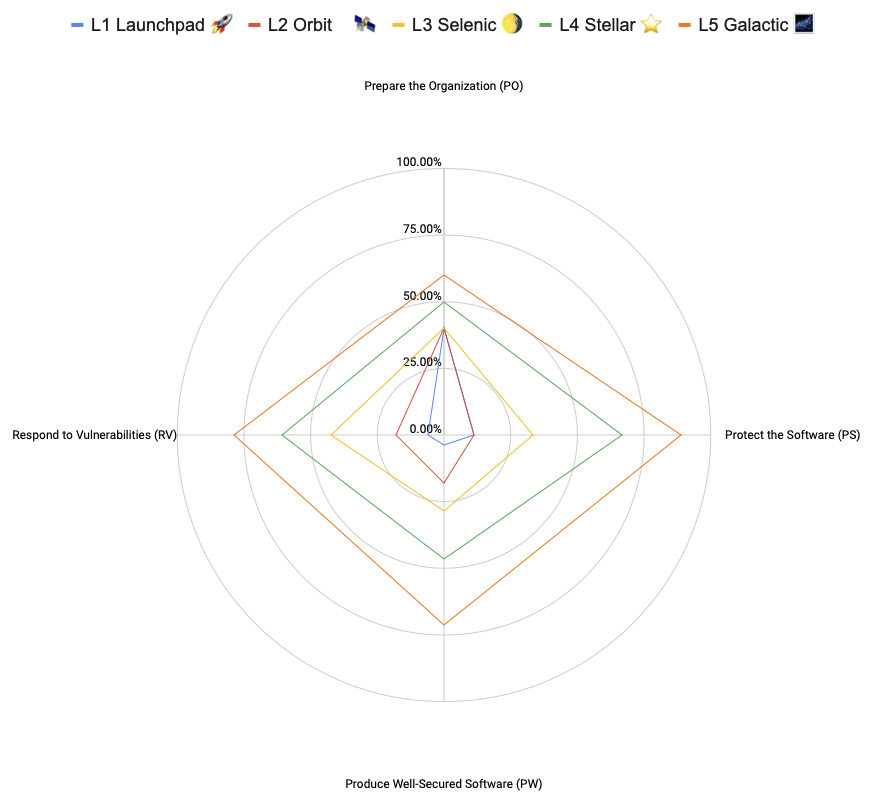

# Eclipse Gradually — Mapping with other frameworks

## SLSA 1.0

[SLSA](https://slsa.dev) is a set of incrementally adoptable guidelines for supply chain security, established by industry consensus. SLSA is organized into a series of levels that provide increasing supply chain security guarantees.

SLSA levels are split into tracks. Each track has its own set of levels that measure a particular aspect of supply chain security. Currently, only the Build track is specificed, with 3 levels levels. A fourth level and a Source track may be added in future version.

The [build track](https://slsa.dev/spec/v1.0/levels#build-track) levels focus on linking the generated artifacts to the source code and the build platform used to create them. It relies exclusively on the capabilities of the [build platform chosen by the developers](https://slsa.dev/spec/v1.0/requirements#build-levels). Consequently, the SLSA Build Level is determined by the properties of the provenance information inherited from the platform that generated it.

 Gradually Security Level | SLSA Build Level | Comment |
---|---|---|
L1 Launchpad 🚀 | Partial Build L2 | Projects at the Launchpad level are expected to use scripted builds and run them on a build service. However, they are not required to generate any provenance information at this stage. Nonetheless, since the build platform must be hosted, this level already meets the *Hosted* requirement of the build platform for SLSA Build L2 compliance. |
L2 Orbit ️🛰️ |  Partial Build L2 | Projects at the Orbit level are expected to implement more stringent controls to prevent building from untrusted sources, though they still do not require provenance generation. |
L3 Selenic 🌖 | Full Build L1, partial Build L3 | Projects at the Selenic level must generate digitally signed build provenance. While there is no requirement regarding the *Accuracy* of the provenance, projects at this level must run builds on a platform that meets all the isolation strength requirements of SLSA Build L3. |
L4 Stellar ⭐️ | Full Build L2, partial Build L3 | Projects at level Stellar must have build provenance generated by the build service. |
L5 Galactic 🌌 | Full Build L3 | Projects at the Galactic level must build artifacts in a non-falsifiable way, meeting the *Unforgeable* requirements of SLSA Build L3. Additionally, projects at the Galactic level must ensure reproducibility, which may become a future requirement for SLSA Build L4.|
L6 Event Horizon ♾️ | Full Build L3 | The requirement for hermeticity of the build may become one of the future SLSA Build L4 requirements. |

## SSDF 1.1

The [SSDF](https://csrc.nist.gov/Projects/ssdf) from NIST is a framework that identifies secure software development practices but does not prescribe how to implement them. The focus is on the outcomes of the practices rather than on the tools, techniques, and mechanisms used.

The practices are organized into four groups:

1. **Prepare the Organization (PO)**: Organizations should ensure that their people, processes, and technology are ready to perform secure software development at the organizational level. Some PO practices may also apply to subsets of software development, such as individual development groups or projects.
2. **Protect the Software (PS)**: Organizations should safeguard all components of their software from tampering and unauthorized access.
3. **Produce Well-Secured Software (PW)**: Organizations should aim to release well-secured software with minimal security vulnerabilities.
4. **Respond to Vulnerabilities (RV)**: Organizations should identify residual vulnerabilities in their software releases and respond appropriately to address them and prevent similar vulnerabilities in the future.

While Gradually in itself serves as implementation of some of the PO tasks (specifically PO.1.1, PO.1.2, PO.3.1, and PO.4.1), the remaining requirements for Gradually fall within the PS, PW, and RV practices.

The tasks listed below are cumulative. For example, if a task like *PS.1.1* is stated at Level 1 and repeated at Level 3, this means that the processes at Level 3 must incorporate or build upon what was required at Level 1.

Gradually Security Level | Description | Tasks |
---|---|---|
L1 Launchpad 🚀 | Entry-level security measures |  PS.1.1, PW.1.3, RV.1.3 |
L2 Orbit ️🛰️ | Basic security measures consistently applied |PW.4.1, PW.4.4, PW.5.1, PW7.2, RV.1.1, RV.1.3 |
L3 Selenic 🌖 | Advanced security practices | PS.1.1, PS1.2, PS.3.2, PW.1.3, PW.4.1, PW.4.4, RV.1.1, RV.1.3, RV.2.1, RV.2.1,  |
L4 Stellar ⭐️ | Near-comprehensive security with continuous improvement | PO.2.2, PS.1.1, PS.2.1, PS.3.2, PW.1.1, PW.4.1, PW.4.2, PW.6.1, PW.6.2, RV.1.1, RV.1.2, RV.2.2 |
L5 Galactic 🌌 | State-of-the-art security practices | PO.5.1, PS.1.1, PS.3.1, PW.4.1, PW.4.4, PW.6.2, PW.7.1, PW.7.2, PW.8.1, PW.8.2, RV.1.1, RV.1.2, RV.2.2, |

